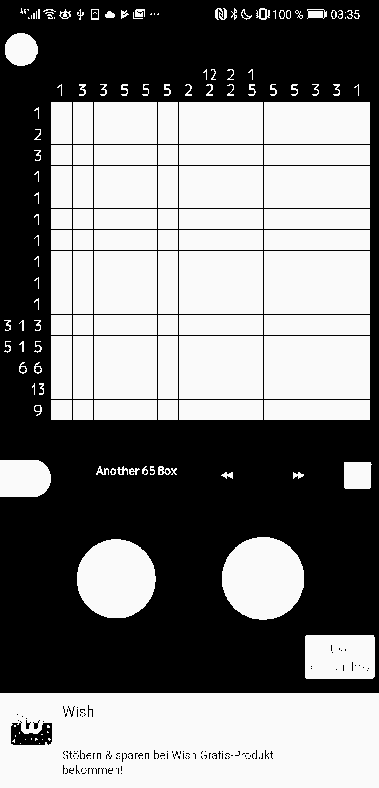

# Nonogram Automatic Solver - python3
Code to solve a nonogram from Nonogram999 on my android phone using opencv-python and Microsoft Lobe. The solving algorithm solvePuzzle.py is from [rosettacode](https://rosettacode.org/wiki/Nonogram_solver#Python_3) under GNU Free Documentation License 1.2

## Usage
### Install necessary dependencies.
Follow instructions on https://github.com/lobe/lobe-python to install Lobe Python API
```bash
# make sure pip is up to date
python -m pip install --upgrade pip
# install
pip install git+https://github.com/lobe/lobe-python
# install opencv
pip install opencv-python
```
### Create a screenshot of a nonogram named nonogram{number}.png


### Run solvePuzzle.py and supply the nonogram number
```bash
> python solvePuzzle.py
Please provide the nonogram number and check that nonogram png file exists (i.e. nonogram12.png): 13
...
Horizontal runs: [[1], [2], [3], [1], [1], [1], [1], [1], [1], [1], [3, 1, 3], [5, 1, 5], [6, 6], [13], [9]]
Vertical runs: [[1], [3], [3], [5], [5], [5], [2], [12, 2], [2, 2], [1, 5], [5], [5], [3], [3], [1]]
Solution would be unique
. . . . . . . # . . . . . . .
. . . . . . . # # . . . . . .
. . . . . . . # # # . . . . .
. . . . . . . # . . . . . . .
. . . . . . . # . . . . . . .
. . . . . . . # . . . . . . .
. . . . . . . # . . . . . . .
. . . . . . . # . . . . . . .
. . . . . . . # . . . . . . .
. . . . . . . # . . . . . . .
. . . # # # . # . # # # . . .
. # # # # # . # . # # # # # .
# # # # # # . . . # # # # # #
. # # # # # # # # # # # # # .
. . . # # # # # # # # # . . .

Unique solution.
```

## Design Process
### Image Processing
I need to parse the horizontal and vertical number labels seen on the left and top of the screenshot. 


This is done by doing a houghline transform to find the approximate pixels of each row/column


Then in order to improve computer vision result, I transform this file to a binary color.


Then I use this information to isolate each digit using opencv's text region recognition. [See stackoverflow.](https://stackoverflow.com/questions/24385714/detect-text-region-in-image-using-opencvand) And I crop them with a label according to their position in this format: 
```{left/top}\_{index of row/column}\_{index within each row/column}\_{single/left/right}.png. ```

To increase the number per label, I decide to split the double digit numbers and create an image for each digit, since it is hard to find the same double digit number samples for the machine learning process to work. 

So number 13 on the left has label left_13_0_left.png  and left_13_0_right.png  and the number 9 on the left has label left_14_0_single.png 

These values are then labeled and trained using Microsoft Lobe.


The model is then exported and used to identify new nonogram screenshots.

### Solving Puzzle
The solving function requires the specific format of the following in a text file.
Horizontal: "C BA CB BB F AE F A B"
Vertical: "AB CA AE GA E C D C"
Here A=1, B=2, and so on using ASCII code.

A new screenshot goes through the image processing to create such function.

## Improvements
1. Image processing can be more generic with a more diverse machine learning model to recognize fonts from various apps.
2. Identification of the two digit numbers currently utilizes the fact that the game uses green for single digits. A separate machine learning model might be able to identify whether this number is part of a single/double digit number.
